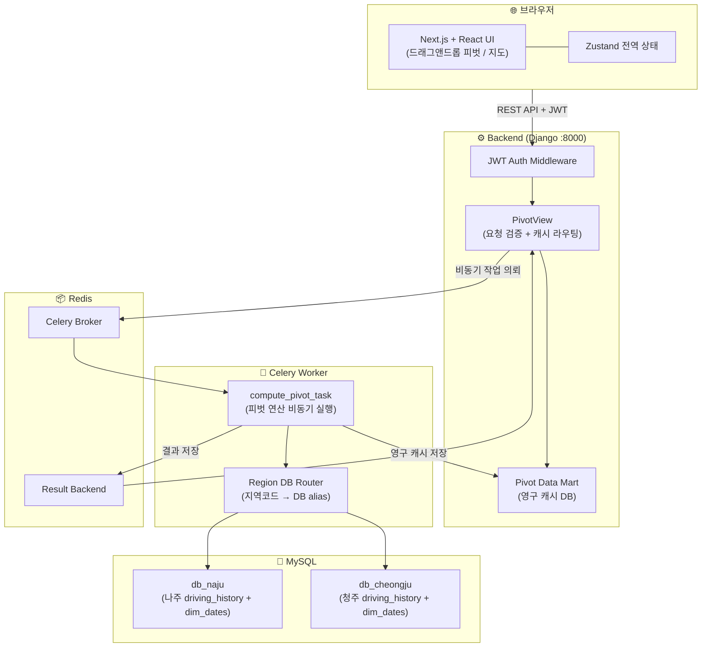
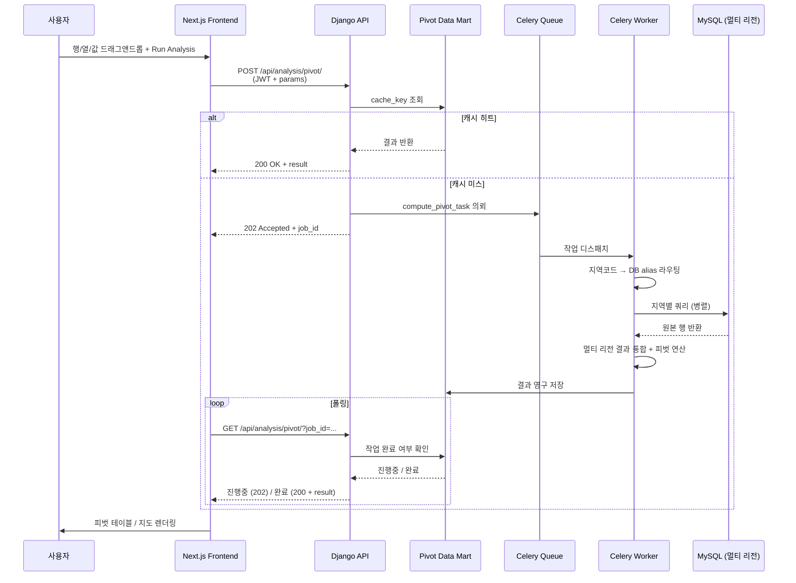
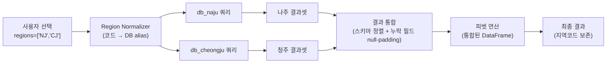

# 아키텍처 다이어그램

DRT 운영 데이터 분석 플랫폼의 시스템 구조와 동작 방식을 다이어그램으로 정리합니다.
소스 코드는 사내 보안 정책상 비공개이며, 본 문서로 작업 범위와 설계 의도를 보여드립니다.

> 📘 **주요 의사결정 기록(ADR):** [decisions.md](./decisions.md) — 캐시 전략 전환, 멀티 리전 DB 도입, Mutation Testing 채택 사유와 트레이드오프

---

## 1. 시스템 아키텍처 (System Architecture)

**핵심 설계 결정:**
- **Celery 비동기 처리:** 피벗 연산이 길어서 동기 응답이 불가능. 작업 의뢰 후 폴링 방식.
- **영구 DB 캐시 (Pivot Data Mart):** Redis는 휘발성. 동일 분석 재요청 시 재계산 비용을 줄이기 위해 결과를 DB에 영구 저장.
- **JWT + 지역 라우팅 분리:** 인증 미들웨어는 공통, DB 라우팅은 작업 단위에서 결정.

---

## 2. 데이터 흐름 시퀀스 (Data Flow Sequence)

**핵심 신뢰성 장치:**
- **task_code_version 스탬프:** Celery 워커 코드 변경 시 캐시 invalidation. 옛 워커가 만든 결과는 자동 거부.
- **stale-meta self-healing:** 응답에 누락된 meta 필드 감지 시 force_update로 1회 자동 재시도.

---

## 3. 멀티 리전 DB 라우팅 (Multi-Region DB Routing)

**핵심 처리:**
- **스키마 차이 흡수:** 청주 DB에 `누적 일자` 컬럼이 추가로 존재. 나주 결과를 통합 시 해당 컬럼을 null-padding으로 정렬.
- **날짜 형식 차이:** 청주는 `YYYY-MM-DD HH:MM:SS` datetime 문자열, 나주는 `YYYY-MM-DD` 평문. `__date_key__` 정규화 컬럼으로 통합.
- **공휴일 캘린더:** `dim_dates`는 양 DB에 공통 존재. 평일/휴일 필터는 둘 모두에 적용.

---

## 4. 도메인 컨텍스트

분석 대상 데이터:
- `driving_history` — 70개 이상의 운영 컬럼 (날짜, 차량, 정류장, 탑승 인원 등)
- `dim_dates` — 양력 캘린더 + 공휴일 분류
- 커버 지역: 전남 나주, 충북 청주

분석 요건:
- 평일/휴일 분리 (공휴일이 평일에 떨어지는 경우 휴일로 분류 — 상호 배타적)
- DAY_AVG 분모는 서비스 시작일과 필터 기간을 비교한 3-case 처리
- 지역별 운영 시점이 달라 DAY_AVG는 지역 단위로 계산
